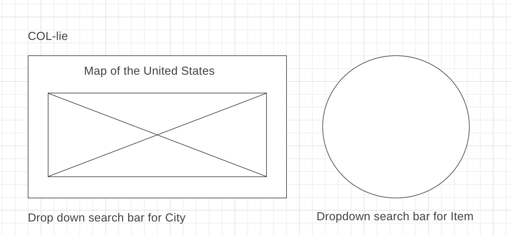

# COL-lie
### Compare Cost of Living Expenses across different cities withithe US

## Background and Overview
COL-lie is an interactive personal finance data visualization that will allow users to compare the various cost of living expenses across different cities cities within the U.S. Users will be able to select a city the interactive map and then compare prices of different items within the city.

## Functionality & MVP

In COL-lie, users will be able to:

* Select cities on a map
* The map will be a variation of a "heart chart" based on the living index
* View how much certain items cost in that city

## Wireframes

## Architecture and Technologies

The project will consist of the following technologies:
* D3.js for the data visuals
* Parsehub to scrape data

Data source:
* Numbeo - cost of living API - https://www.numbeo.com/cost-of-living/

## Implementation Timeline

### Day 1: 

* Finalize project proposal and clean up wireframe
* Finish brainstorming, looking up data sources and framing the project

### Day 2:

* Set up the data structure of the json file and make sure relevant data points are present
* Set up webpack and get it up and running
* Learn D3 and practice rendering sample data
* Complete skeleton render page and render cost of living data

### Day 3:

* Render and style data

### Day 4: 

* Continue to play with styling and make sure data is flowing through properly

### Day 5: 

* Add links to Github and Linkedin

### Over the Weekend
 
 * Finalize styling
 * Squash bugs

## Bonus features

* Search for cities in a search bar - city will be highlighted on map
* Search for items in a search bar - item will be highlighted on sunburst chart